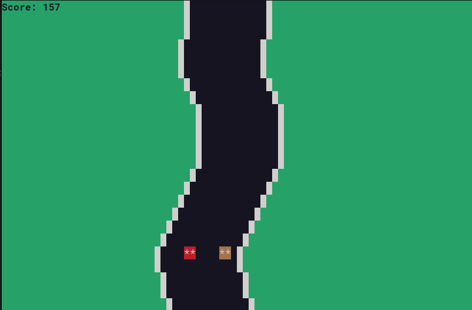

# cli-race

Minimal and lightweight race game that runs on command line interface.

## Commands

- `a`: left
- `d`: right
- `esc`: quit the game

## Versions

- `cli-race`:
	- source code size: 5060 bytes
	- compiled executable size: 17264 bytes

- `min-cli-race`: 
	- source code size: 1723 bytes
	- compiled executable size: 14544 bytes

## Instructions

- `make`: compile

- `run`: run cli-race

- `run_min`: run min-cli-race

## Screenshot

